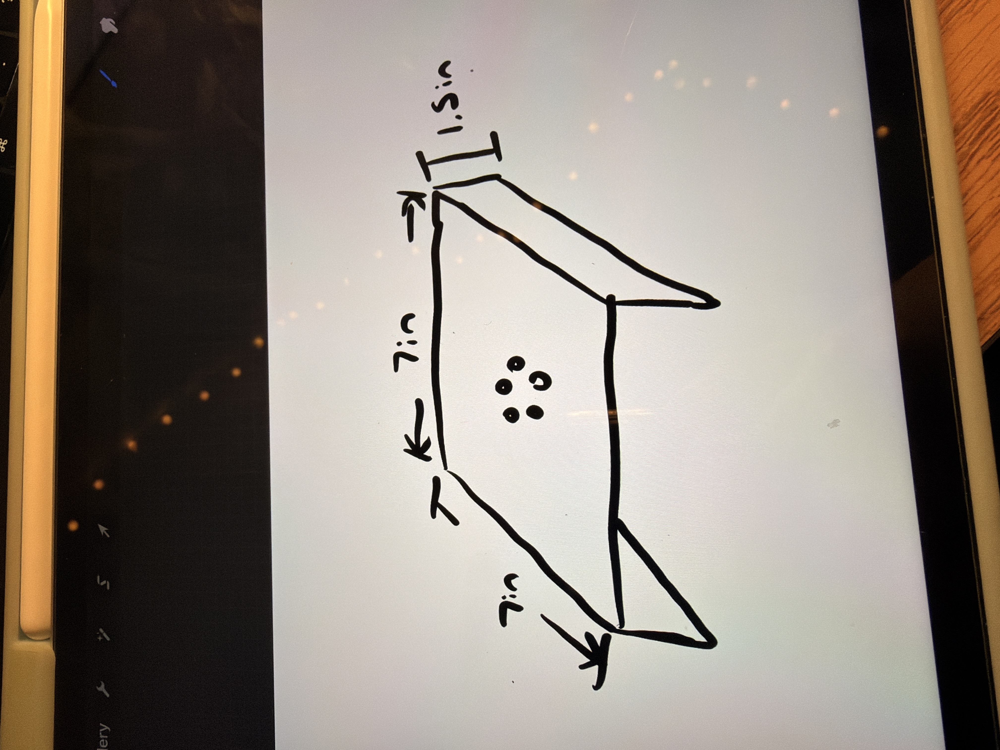
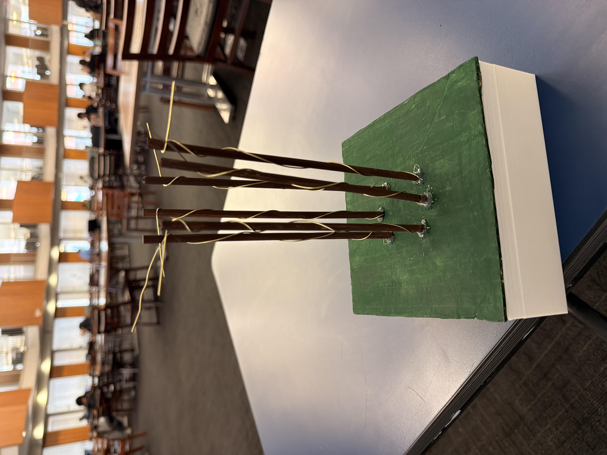
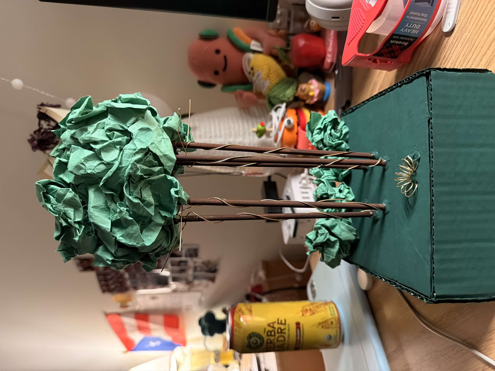

# Creative Embedded Systems - Interactive Devices - My Singing Tree

Creative Embedded Systems, Spring 2026

This project is a interactive device installation that lets you mix monster sounds from *My Singing Monsters* using capacitive touch. It is a physical, tree-shaped instrument where six brass rods act as touch sensors connected to an ESP32, which streams data to a Python host that triggers and layers WAV audio in real time.

## Project Structure

```
msm_tree_project/
  src/
    main.cpp        # ESP32 firmware — reads touch pins, sends serial events
  reader.py         # Python host script — receives serial data, plays audio
  platformio.ini    # PlatformIO build config
  audio/            # WAV sound files (not tracked in repo)
```

## How It Works

Each brass rod is wired to a capacitive touch pin on the ESP32. When you touch a rod, the ESP32 sends a pin/state event over serial to the host laptop. A Python script receives these events and plays the assigned monster sound using `pygame`. You can hold rods, layer multiple sounds at once, double-tap to randomize a rod's sound, and switch between play modes using the spiral rod at the front of the tree.

## Materials

### Hardware

| Item | Notes |
|---|---|
| LILYGO T-Display ESP32 (TTGO T1) | Microcontroller |
| USB-C cable + power source | Powers the ESP32 and connects to laptop |
| 6 brass rods | Touch sensors |
| Small breadboard | Connects rods to ESP32 GPIO pins |
| Solid core wire | Connects rods to breadboard |
| Soldering iron + solder | Attaches wire to brass rods |
| Wooden popsicle sticks + wooden dowels | Tree structure |
| Construction paper | Tree decoration / leaves |
| Paint | Finishing the enclosure |
| Hot glue gun | Assembly |

### Software & Tools

| Tool | Purpose |
|---|---|
| [PlatformIO](https://platformio.org/) (VS Code extension) | Build and upload ESP32 firmware |
| Python 3.9+ | Host-side audio script |
| `pyserial` | Read serial data from ESP32 |
| `pygame` | Audio playback |
| WAV audio files | Monster sound clips (not included — see below) |

## Wiring

The brass rods connect to the following ESP32 GPIO touch pins via the breadboard:

| Brass Rod | GPIO | Touch Pin | Role |
|---|---|---|---|
| Rod 1 | GPIO 2 | TOUCH2 | Monster sound |
| Rod 2 | GPIO 15 | TOUCH3 | Monster sound |
| Rod 3 | GPIO 13 | TOUCH4 | Monster sound |
| Rod 4 | GPIO 32 | TOUCH9 | Monster sound |
| Rod 5 | GPIO 33 | TOUCH8 | Monster sound |
| Spiral rod (front) | GPIO 12 | TOUCH5 | **Mode switch** |
| Rod 6 | GPIO 27 | TOUCH7 | Monster sound |

**Installation:** Solder a solid core wire to the base of each brass rod, then plug the other end into the corresponding GPIO row on the breadboard. Connect the breadboard to the ESP32's GPIO pins using short jumper wires.

## Reproducibility

### 1. Clone the Repository

```bash
git clone https://github.com/kristymrz/msm_tree_project.git
cd msm_tree_project
```

### 2. Add Audio Files

Place your `.wav` monster sound files inside an `audio/` folder at the project root:

```
msm_tree_project/
  audio/
    01-BDE_Monster_01.wav
    01-E_Monster_01.wav
    01-BE_Monster_01.wav
    01-BD_Monster_01.wav
    01-G_Monster_01.wav
    01-Z01_Monster_01.wav
    ... (any additional .wav files for random reassignment)
```

> Audio files are not included in this repository due to copyright. Source your own WAV clips from *My Singing Monsters* or substitute any `.wav` files you prefer.

### 3. Install Python Dependencies

```bash
pip install pyserial pygame
```

### 4. Build and Upload the ESP32 Firmware

1. Open the project in VS Code with the PlatformIO extension installed.
2. Connect the ESP32 via USB-C.
3. Click **Upload** in PlatformIO (or run `pio run --target upload`).

The board target is `ttgo-t1` (Espressif32 platform, Arduino framework, TFT_eSPI library).

### 5. Find Your Serial Port

On macOS/Linux:
```bash
ls /dev/cu.*
```
On Windows, check Device Manager for the COM port.

Update the `PORT` variable at the top of `reader.py`:
```python
PORT = "/dev/cu.usbserial-XXXXXXXX"  # replace with your port
```

### 6. Run the Host Script

```bash
python reader.py
```

## Usage

### Playing Sounds

- **Touch and hold** a brass rod to play its assigned monster sound (Mode 1).
- **Release** the rod to stop playback.
- You can touch **multiple rods at the same time** to layer sounds.

### Switching Modes

Tap the **spiral brass rod at the front of the tree** (Touch Pin 5 / GPIO 12) to toggle between modes:

| Mode | Behavior |
|---|---|
| **Mode 1** (default) | Hold rod to play; release to stop |
| **Mode 2** | Tap rod to start looping; tap again to stop |

### Randomizing Sounds

**Double-tap** any brass rod (two quick taps within 0.5 seconds) to randomly reassign that rod to a different monster sound from the `audio/` folder. This lets you remix on the fly without restarting the script.

## Final Product!


## Additional Photos and Videos
Documenting some parts of my planning, build process and some behind the scenes testing!








[](https://www.youtube.com/watch?v=5ruc0Ziv5HA)

note: the video is very chaotic lol 